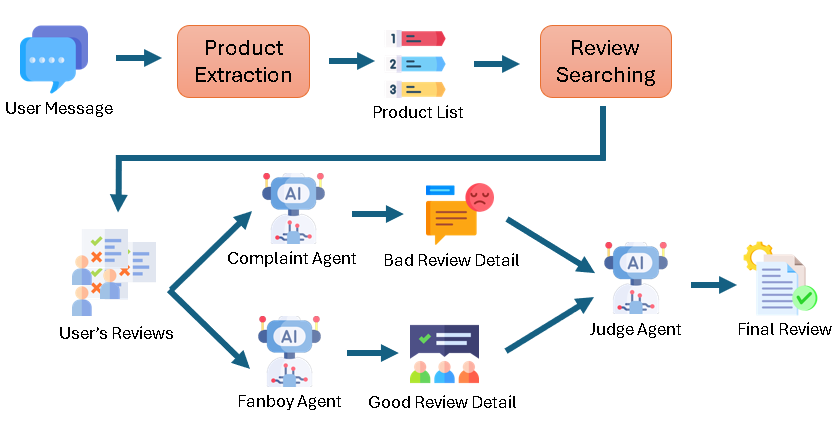
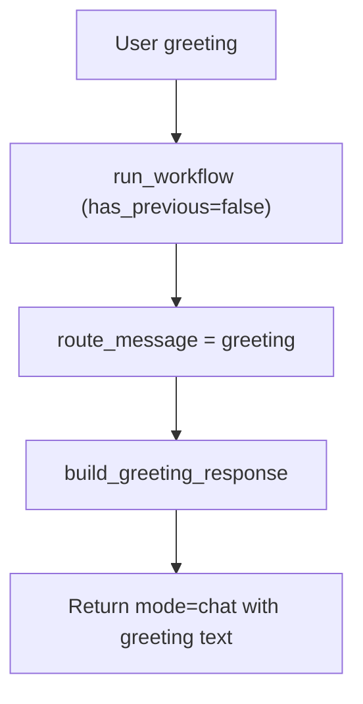
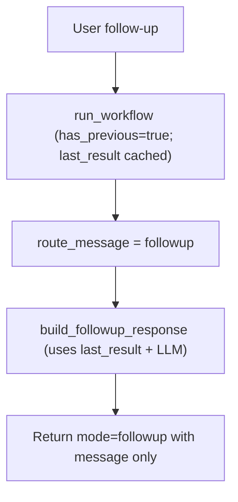
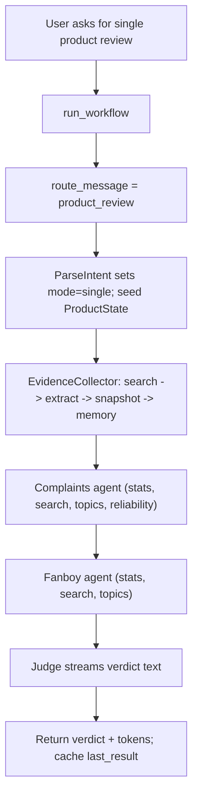
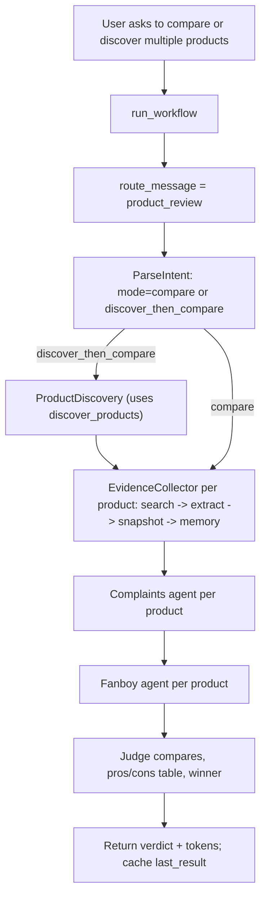
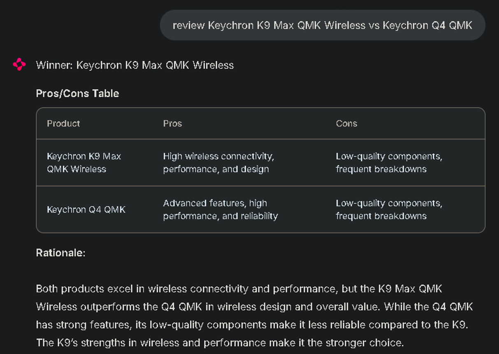
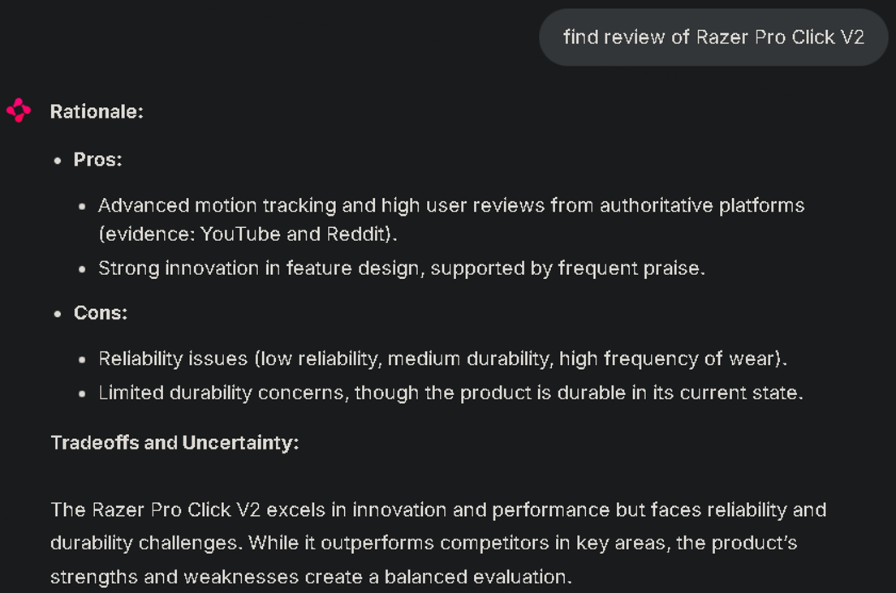

# Product Review Court (Agentic RAG)



## Overview

- Purpose: Agentic workflow that searches for product reviews, extracts evidence, and runs a courtroom-style debate (Complaints vs. Fanboy) before the Judge issues a verdict.
- Backend: [FastAPI](https://fastapi.tiangolo.com/) + [LangChain](https://python.langchain.com/) + [LangGraph](https://langchain-ai.github.io/langgraph/) + [Ollama](https://ollama.com/)
- Frontend: [Chainlit](https://docs.chainlit.io/) chat UI


## Quick start

### Pre-requisite
- Ollama: install and pull a compatible model (e.g., `ollama pull qwen3:0.6b`); set `OLLAMA_BASE_URL` if not using the default local endpoint.
- Google Custom Search: create an API key and Custom Search Engine; export `GOOGLE_API_KEY` and `GOOGLE_CSE_ID`.
- LangSmith (optional tracing): set `LANGCHAIN_TRACING_V2=true`, `LANGCHAIN_PROJECT`, and `LANGCHAIN_API_KEY`.
- Postgres (optional): set `DATABASE_URL` and run `python -m app.db_setup` if you want DB-backed product metadata/reviews.
- Persistence: ensure `data/` is writable for `global_memory.json` and (if enabled) `chat_memory.sqlite`.

### How to run the code

Use LangGraph workflow with a chat UI:

```bash
pip install -r requirements.txt
export LANGCHAIN_TRACING_V2=true
export LANGCHAIN_PROJECT=product-review-court
export LANGCHAIN_API_KEY=<your-key>
chainlit run app/chainlit_app.py -w
```

Chainlit streams tokens from the Synthesizer node and keeps per-session memory aligned with the FastAPI backend.

## LLM configuration and tuning

- `OLLAMA_TEMPERATURE` and `JUDGE_TEMPERATURE` (optional override): control generation temperature; the judge uses `JUDGE_TEMPERATURE` when set, otherwise the global value.
- `JUDGE_MAX_OUTPUT_TOKENS`: caps the judge node's output length (`num_predict` passed to Ollama) so verdicts stay concise.
- `OLLAMA_NUM_CTX`: sets the context window (`num_ctx`) for every node that instantiates the Ollama client (intent parsing, routing, agents, tools, judge, synthesizer). Increase only if your model supports it.

Set these in your environment or `.env` before starting the app or Docker Compose stack.

### Docker Compose (API + Chainlit)

```bash
docker compose up --build
```

Services:
- API: http://localhost:8000
- Chainlit UI: http://localhost:8001 (memory data layer by default)

## Code map

```
app/
├─ api.py              # FastAPI entrypoint; /api/chat wraps run_workflow
├─ chainlit_app.py     # Chainlit chat UI streaming workflow tokens
├─ config.py           # Runtime settings (Ollama, LangSmith, Google CSE, DB, memory paths)
├─ db.py               # Optional Postgres product lookup (psycopg2)
├─ db_setup.py         # Creates Postgres tables for products/reviews
├─ graph.py            # LangGraph workflow: intent -> discovery -> evidence -> complaints/fanboy -> judge
├─ llm.py              # Ollama client builder with stub fallback
├─ memory.py           # JSON-backed global memory; optional LangGraph chat history
├─ parsing.py          # LLM intent parser for mode/products/constraints
├─ routing.py          # Greeting/followup/product routing heuristics + LLM classifier
├─ agents/
│  ├─ base.py          # Minimal tool-agent scaffolding (LangChain-like)
│  ├─ complaints.py    # Prosecutor prompt + tools (stats/search/topics/reliability)
│  ├─ fanboy.py        # Defense prompt + tools (stats/search/topics)
│  └─ judge.py         # Judge prompt (no tools), verdict synthesis
└─ tools/
   ├─ review_tools.py  # Web search, discovery, review extraction, snapshots, stats, search, topics, reliability
   └─ __init__.py      # Tool exports

data/
├─ global_memory.json  # Cached snapshots and per-user state
└─ chat_memory.sqlite  # LangGraph checkpointer (if enabled)
```


## GPU with Docker Compose

- The `ollama` service now reserves all available NVIDIA GPUs via `deploy.resources.reservations.devices`; ensure Docker has the NVIDIA Container Toolkit installed so `docker compose up` can pass your GPU through.
- Verify GPU visibility with `docker compose exec ollama nvidia-smi` (or `ollama list`) after the stack is up.

## Agents and tools

### Tools and utilities
  - `web_search_review_pages`: Google CSE search for review-like URLs; accepts product query plus optional site/region/recency filters.
  - `discover_products`: turns a category/brand/spec prompt into candidate product titles by searching the web; used when the user asks to discover then compare.
  - `fetch_and_extract_reviews`: fetches a page, strips text, has the LLM extract reviews JSON, and normalizes evidence (ids, source, rating, text).
  - `create_review_snapshot`: packages reviews + source URLs into a snapshot payload and returns a snapshot id for downstream tools/agents.
  - `get_review_stats`: counts reviews, lists sources, and returns basic stats from snapshot data.
  - `search_reviews`: lexical search within snapshot reviews for a query string.
  - `cluster_review_topics`: samples reviews and uses the LLM to cluster themes and estimate sentiment per topic.
  - `compute_long_term_reliability`: counts failure-keyword mentions in reviews to estimate a simple failure rate.

### Agents
  - Complaints agent: builds the case against a product using `get_review_stats`, `search_reviews`, `cluster_review_topics`, and `compute_long_term_reliability` to find volume, relevant snippets, themes, and failure signals.
  - Fanboy agent: builds the case for a product using `get_review_stats`, `search_reviews`, and `cluster_review_topics` to surface strengths and supportive evidence (no reliability tool).
  - Judge agent: uses no tools; synthesizes the provided product cases (complaints/fanboy outputs plus evidence metadata) into a verdict with headline, rationale, pros/cons, and a winner in compare mode.

## End-to-end examples (flows)

### Case 1: Getting a greeting message



### Case 2: Getting a follow-up message



### Case 3: Getting a single product review



### Case 4: Getting multiple products for review/compare



## Example




## Notes
- Global memory persists to `data/global_memory.json` by default.
- The code is tested with Qwen3-0.6B model.
